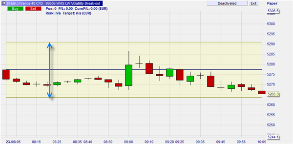
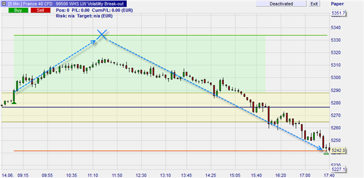
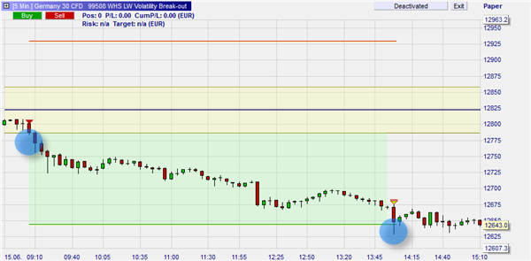

# Algo-trading-project

## About The Strategy

Volatility Break-out strategies are based on the concept that if the market makes a movement of a certain size in a short period of time, this movement will continue and positions can be opened to capitilize on this movement. Volatility, as [defined by Investopedia](https://www.investopedia.com/terms/v/volatility.asp), is the measurement of movement by either the Standard Deviation or variance between the same security. While the typical Volatility strategy and that definition don't match 1-to-1, the thought behind them are the same. A particular strategy created by trader Larry Williams includes a multiplier number in order to figure out how large the move needs to be before a trader takes action. By default, Larry suggests 25%. That number is then multiplied by the previous day’s High and Low. Those respective numbers are then added and subtracted from the current Open price to create a "Range"1.

Larry Williams then suggests opening a position based on the following factors:

- Long: When price rises higher than the breakout area
- Short: when the price falls below the breakout area

Larry also has suggests closing a position if:

1. When the current price is two times (2x) the range

	or

2. After 24hours

## Our proposal
We want to find out if this strategy can be improved on using Machine Learning to determine if we can find a better % multiplier to use or if Larry Williams was on the money with the use of a 25% move. WE are looking to use the following markets to test:

- S&P 500 Index (Stock ticker SPX)
- CBOE Volatility Index (Symbol VIX)
- Bitcoin (Symbol BTC)

We are hoping to answer the following questions:

1. Does a 25% move produce a winning trading strategy?
2. Can Machine Learning provide a better metric for price movement than what Larry Williams presents?
3. Can one trade using this strategy and the default 25% move or ML percent move perform better than buying and holding a security?
4. If successful, how often does this strategy require review of the percent move number?

## Sources
1. [Williams, Larry "Long-Term Secrets to Short-Term Trading" 6 Dec. 2011. Accessed 21Feb. 2022.](https://www.amazon.com/Long-Term-Secrets-Short-Term-Trading-Williams/dp/0470915730/ref=sr_1_2?keywords=long+term+secrets+to+short+term+trading+by+larry+williams&qid=1645494049&sprefix=short+term+sec%2Caps%2C117&sr=8-2)