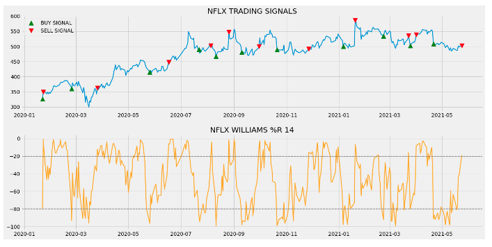

# **Larry Williams Algorithmic Trading Strategies**


### Project Team Members:
- Andrew Crawford
- Servontius Turner
- Sylvia Fan
- Sam Kohnle

#

### Project Objective  

#

We set out to test the Williams % R and the Williams Break-Out Volatility (BOV) strategy on historical market data using python. We will compare the returns of the strategies to see if any outperform the market or the buy and hold strategy.

#


# About The Strategies

### Volatility Break-out:

Volatility Break-out strategies are based on the concept that if the market makes a movement of a certain size in a short period of time, this movement will continue and positions can be opened to capitilize on this movement. Volatility, as [defined by Investopedia](https://www.investopedia.com/terms/v/volatility.asp), is the measurement of movement by either the Standard Deviation or variance between the same security. While the typical Volatility strategy and that definition don't match 1-to-1, the thought behind them are the same. A particular strategy created by trader Larry Williams includes a multiplier number in order to figure out how large the move needs to be before a trader takes action. By default, Larry suggests 25%. That number is then multiplied by the previous day’s High and Low. Those respective numbers are then added and subtracted from the current Open price to create a "Range"<sup>1</sup>.


Larry Williams then suggests opening a position based on the following factors:

- Long: When price rises higher than the breakout area
- Short: when the price falls below the breakout area

Larry also has suggests closing a position if:

1. When the current price is two times (2x) the range

	or

2. After 24hours


# 


#

### Williams Percent Range (% R):


Williams %R, as [defined by Investopedia](https://www.investopedia.com/terms/w/williamsr.asp), also known as the Williams Percent Range, is a type of momentum indicator that moves between 0 and -100 and measures overbought and oversold levels. The Williams %R may be used to find entry and exit points in the market. The indicator is very similar to the Stochastic oscillator and is used in the same way. It was developed by Larry Williams and it compares a stock’s closing price to the high-low range over a specific period, typically 14 days or periods." 



#

## Our Modifications

#

We want to find out if this strategy can be improved with a better % multiplier or if Larry Williams was on the money with 25%. We are looking to use the following markets to test (Larry trades in futures markets):

- S&P 500 Index (Stock ticker SPX)
- CBOE Volatility Index (Symbol VIX)
- Bitcoin (Symbol BTC)


We are hoping to answer the following questions:

1. Does a 25% move produce a winning trading strategy?
2. Can one trade using this strategy and the default 25% move perform better than buying and holding a security?
3. If successful, how often does this strategy require review of the percent move number?

#

# Implementation in Python

1. Importing Packages
2. Read CSV data into a Pandas DataFrame and clean data 
3. Define functions for each strategy
4. Run and Display Entry/Exit Points
5. Backtesting
6. Display with streamlit


## Step 1: Imports

#

AlgoFunctions.py
```
import numpy as np
import pandas as pd
```

PlotFunctions.py
```
import pandas as pd
from AlgoFunctions import Algo
import hvplot.pandas
from pandas.core.frame import DataFrame
import matplotlib
import matplotlib.pyplot as plt
```

BacktestFunctions.py
```
import numpy as np
```

App.py
```
import streamlit as st
from pathlib import Path
from PlotFunctions import *
import holoviews as 
```
#

## Step 2: Read CSV data into a Pandas DataFrame using pd.read_csv and clean it to include the Williams Percent Range and the Short-Window Moving Average columns

#


#

## Step 3: Create a class to hold the functions for each strategy 


- def __init__(self, short_window, long_window):
Each St
- def get_william_r(high, low, close, lookback):
- def ma_cross(short_window, df, percent: int):
- def williams_r(df, percent: int):
- def vol_breakout(dataframe, percentage: int):

#

Code explanation: Refer to [AlgoFunctions.py](https://github.com/Crawnicles/Algo-trading-project/blob/main/AlgoFunctions.py)

#

## Step 4: Define Entry/Exit Points to plot for each strategy

#


#


#


#

Code explanation: Refer to [PlotFunctions.py](https://github.com/Crawnicles/Algo-trading-project/blob/main/PlotFunctions.py)

#


## Step 5: Backtesting

#


Our results suggest that using strategy 2, the Williams % R in the Bitcoin markets would return up to ~350% in late 2021 if beginning with a $100,000 investment five years ago.

#


#


#


#

Code explanation: Refer to [BacktestFunctions.py](https://github.com/Crawnicles/Algo-trading-project/blob/main/BacktestFunctions.py)

#

## Step 6: Display with streamlit

#

Refer to [App.py](https://github.com/Crawnicles/Algo-trading-project/blob/main/App.py)

#

## Additional research


Can Machine Learning provide a better metric for price movement than what Larry Williams presents?

Can one trade using this strategy and the default 25% move or ML percent move perform better than buying and holding a security?

## Sources
1. [Williams, Larry "Long-Term Secrets to Short-Term Trading" 6 Dec. 2011. Accessed 21Feb. 2022.](https://www.amazon.com/Long-Term-Secrets-Short-Term-Trading-Williams/dp/0470915730/ref=sr_1_2?keywords=long+term+secrets+to+short+term+trading+by+larry+williams&qid=1645494049&sprefix=short+term+sec%2Caps%2C117&sr=8-2)
2. [Algorithmic Trading with Williams %R in Python](https://medium.com/codex/algorithmic-trading-with-williams-r-in-python-5a8e0db9ff1f)

3. [Investopedia Williams %R Definition](https://www.investopedia.com/terms/w/williamsr.asp)

